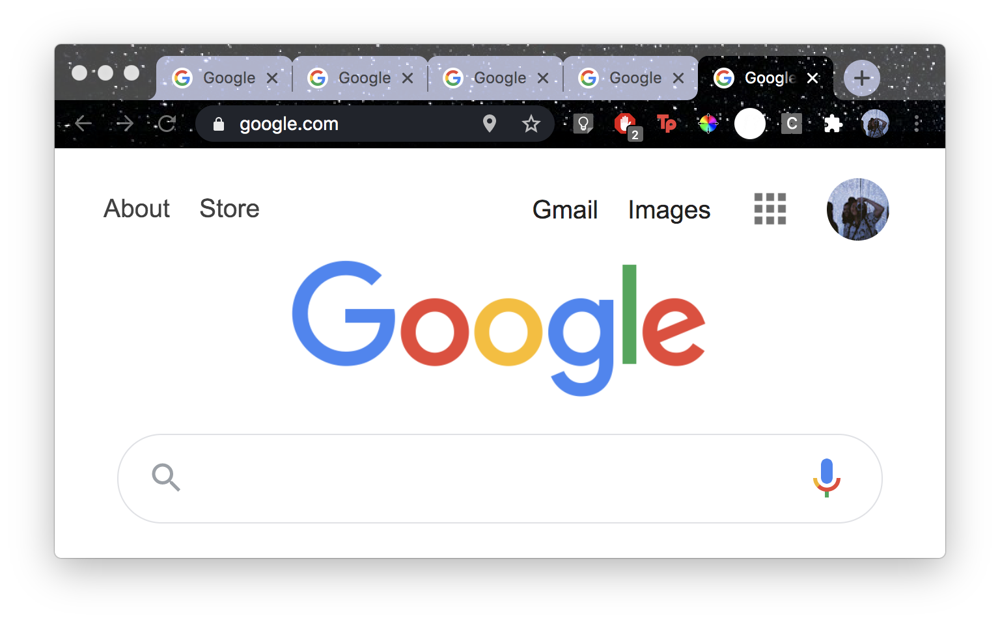

This extension discourages the user from opening too many tabs. Each tab opened will shrink the window and zoom in on the page, making web usage inconvenient. When the user deletes tabs, the window increases in size and zooms out, giving the user some breathing room. 
