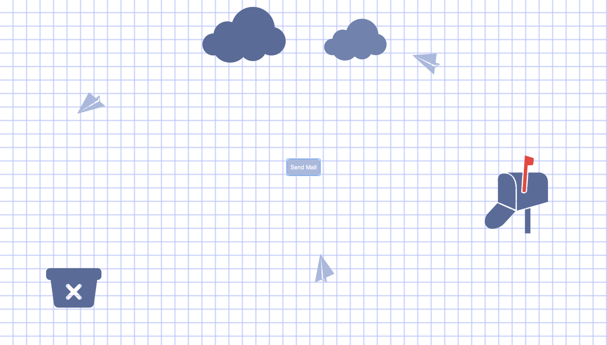

<h1>You've got mail</h1>

"You've got mail" is an email simulation that invites the user to play instead of work. Users will recognize typical email folders, such as Inbox, Sent, Drafts, and Spam, in which they can play with the concept of each folder but with unique interactions. I utilized our previous learnings of inputs, CSS animations, and windows.
  
The biggest challenge I faced was figuring out how to animate the flying paper planes on the Sent page. Originally, I had intended to fill the page with planes that flew in random directions and would change directions when the user clicked on them. When trying to research how to do this, the solutions I found all used jQuery, something I'm not familiar with. So, I decided to compromise and instead choreograph movement using CSS animations. I wanted the planes to fly in curves by animating the X and Y coordinates at the same time, but had struggles implementing the solutions I found online.   
Finally after more researching, I found the offset-path function in CSS which utilizes SVG paths to move elements on a path. Using offset-path, I was able to easily design a path in Illustrator to generate a CSS code. While I was able to create smooth animations, I was unable to make the path responsive. So, I had to sacrifice the page's adaptability to multiple sizes to get my desired animations.
  
With more time, I would have wanted to add more design elements to make the project an even more visually engaging experience. However, I was able to gain a better understanding of web interactions and I am happy with how the the project turned out overall.
  
Check out the project
[here.](https://jennifercheung8.github.io/abc-student-repo/projects/projecta/index.html)
