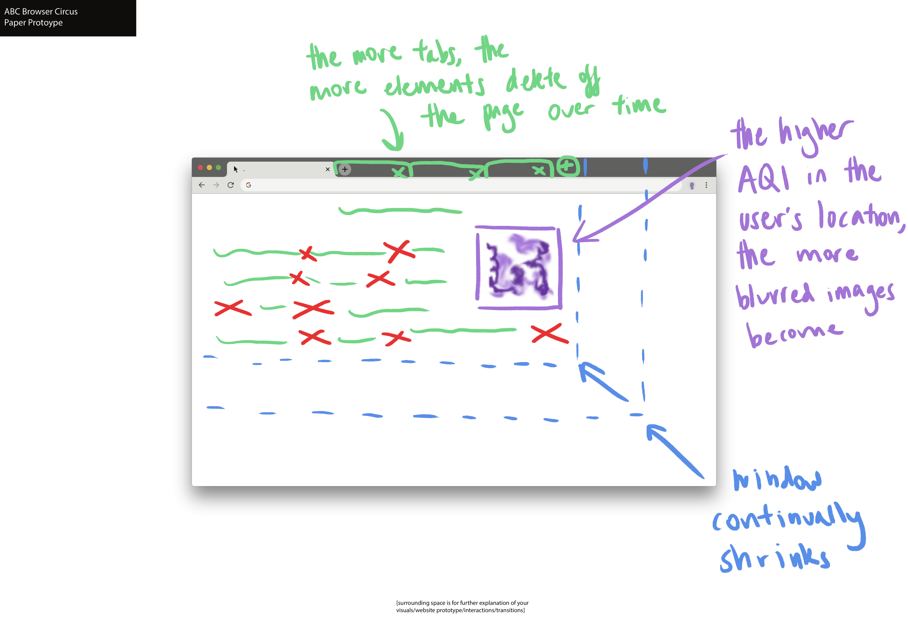

When visiting any website, the extension will shrink the window according to the rate the polar ice caps are melting due to global warming. According to Nasa, the Arctic Sea Ice melted at a rate of approximately 13% every decade from 1979-2015. To visualize this, the window will continually shrink at 13% of the current window size per minute.

In addition, content (images and text) on the website will delete according to how many tabs are open. The more tabs, the more that will be deleted, representing more CO2 leading to more global deterioration. For every tab open, one element will be deleted every 10 seconds. If 10 tabs are open, 10 elements will be deleted every 10 seconds.

Lastly, the extension will gather data about the user’s location and the current AQI levels. The higher the AQI, the more blurred the images will become, mimicking hazier air.

This extension raises awareness about climate change while simultaneously using user data to create a modular, unique experience every time it is used. It does not shy away from being intrusive on the user’s experience, which effectively captures attention and makes the user feel strongly opposed to the way the extension is aggravating their browsing experience.

The intrusions are designed to be bothersome and destructive, which represent how current climate practices are affecting our present and future. CO2 emissions and melting ice caps are easy to ignore in everyday life, but not anymore. The degree to which this extension annoys the user represents how imperative solving this issue is. Furthermore, the amount the destruction accelerates due to increased resource/power consumption (additional tabs’ creation) conveys that actions to lessen worldwide resource and power consumption need to be carried out.

Our goal is to make the user aware of their effects on the climate. Too often are people blissfully unaware of their impact on the climate and the natural world. We want to bring this information right to where people may feel most insulated from the natural world – in the virtual world, while surfing the internet.
