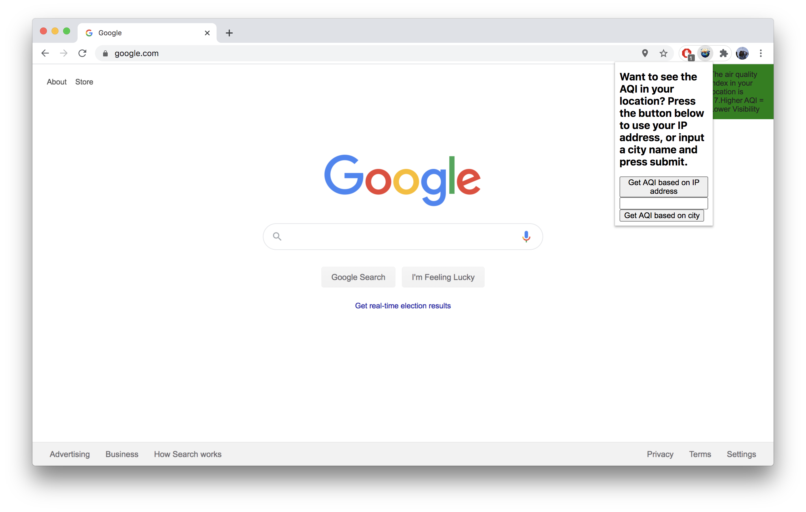

<h1>Global Warming Warning</h1>
Download Global Warming Warning! You can help the public become more aware of climate change and global warming by using and sharing this extension. Learn about the harmful effects of high energy usage, air pollution, and rising sea levels through minimal but uncompromising visual speed bumps in your browser to unobtrusively remind you about these problems, and encourage you to take action to reverse them.

See air pollution manifest itself live on your web browser! Based on your location’s Air Quality Index, the window may become a little harder to see, just like it would be outside when the air is polluted.

Be wary of the ice caps melting! The yearly rate at which ice caps are melting and raising our sea levels will be the same rate that your browser window slowly shrinks. Be careful!

Don’t use too much energy! The more tabs you have open, the more energy you use. You may notice that if we don’t stop our massive energy consumption, nature may start to disappear, which is just what will happen to parts of your web browser too!

For the “element destroyer” part of the extension, we decided to track “climate impact” based on the number of tabs open, and manifest “climate destruction” as HTML element destruction. We initially considered using a more detailed metric of energy usage, for example Joanna Moll’s Hidden Life of an Amazon User, but the tracking methods she employed were far too detailed and convoluted to tackle in the amount of time we planned to complete this project in. The element destroyer uses a background script to keep a tally of the number of tabs. This includes tracking open tabs upon launch of the extension, and then passing messages of tabs being created, closed, and activated to the content script. The content script uses this number to calculate a number of elements to destroy, and then they slowly disappear over time.

For the shrinking window, we wanted to represent the window as ice caps that are melting as a result of rising temperatures, causing rising sea levels. Once the extension is initialized, the window starts to shrink very gradually until the window reaches its minimum size. Initially, there were issues with shrinking multiple windows at once and continuing the shrinking when the window was manually resized. Some of the issues were due to the mixed use of var and let, in which var did not return updated values for each window. The problems were solved by getting the window’s current dimensions each time the window was updated, putting chrome.window.get() within the update interval.

To show the effect of increased forest fires in the US on air quality, we blurred the window’s content based on the AQI of users’ location. To do this, we used an API to get the AQI of users’ IP addresses. With higher AQIs, the window will be blurred more to represent increased haziness in the air. Initially, we had a popup where users had to click a button in order to initiate the blurring, but later changed this so that it would happen on its own. In order to make a clearer connection between the AQI value and the degree of blur, we added an indicator on the screen to clearly display the AQI value and a statement making the connection.
