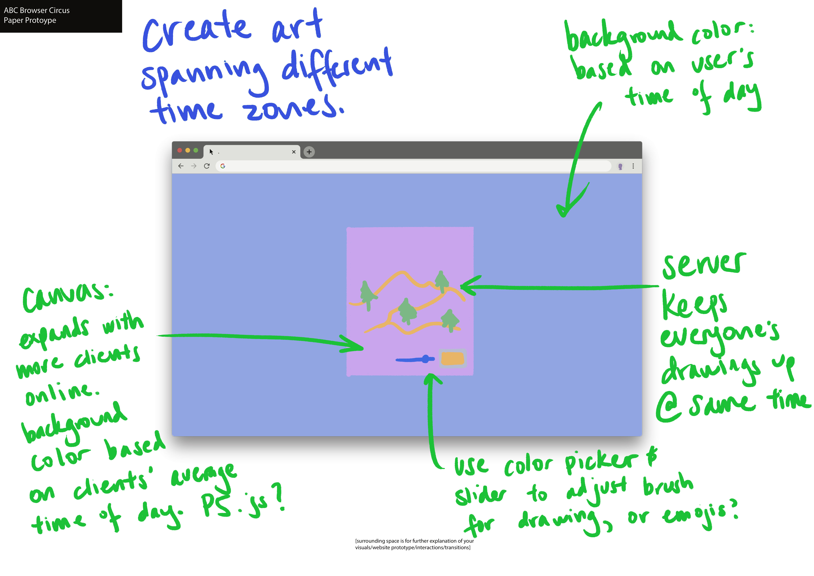
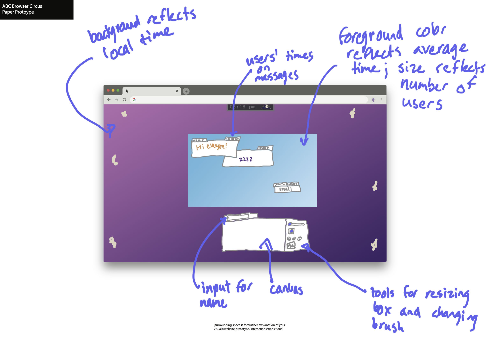
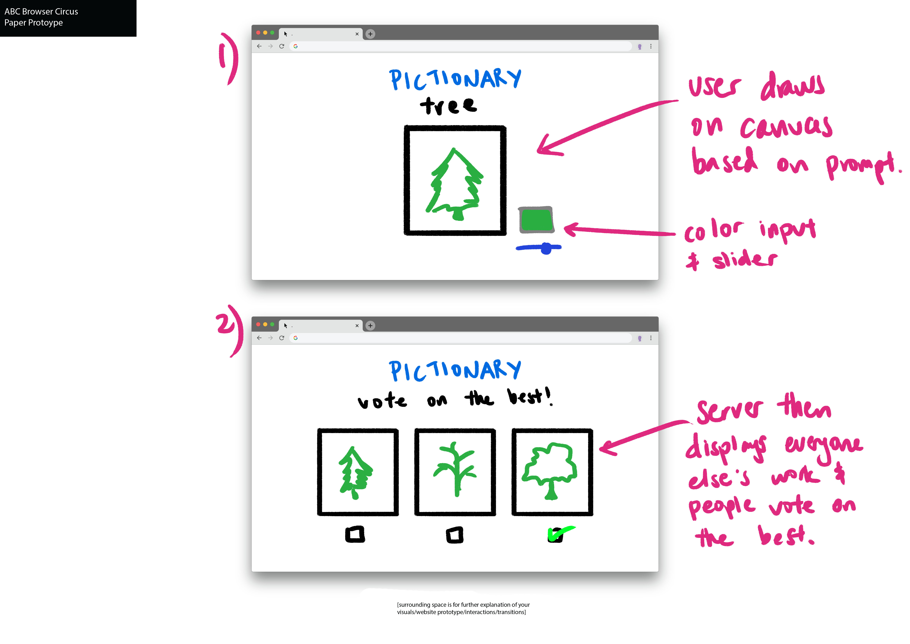

  
First idea:
 
A canvas where people can build off of each others' artwork. Under the theme of internationality, the user's time of day will be reflected in the background color, while the canvas's background color reflects the average time of day of all the clients that are online. The canvas expands as more people go online, such that as the canvas expands, the color of the average time fills more of the screen, representing everyone being connected in the same space.

  
Second idea:
 
Similar to the first idea, but instead of a whiteboard-like canvas, the canvas is a bulletin board for people to post messages.

  
Third idea:
 
A pictionary game where a group of users online can create drawings depending on a prompt and vote on the best one.
